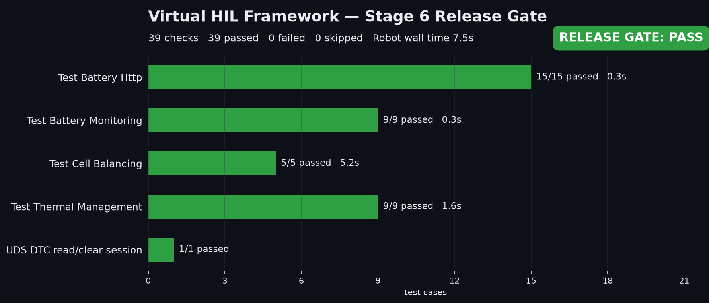
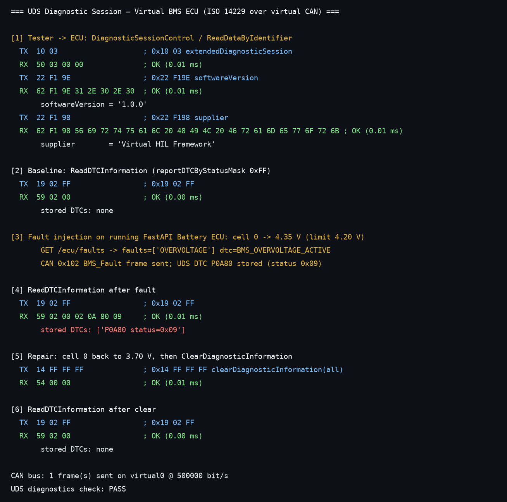

# Stage 6 Demo — Automated Test, Diagnostics & Release Gate

Single-command, real-execution demo of the Virtual HIL Framework as the release gate
at the end of the Simulink → Embedded Coder → firmware → AUTOSAR → Virtual HIL pipeline.

## Run it

```bash
./demo/run_demo.sh          # ~30 s, needs uv (https://docs.astral.sh/uv/) and curl
```

What the script does (all for real, nothing mocked):

| Step | Command | Output in `demo/out/` |
|------|---------|-----------------------|
| 1 | `uv sync --extra dev --extra demo && uv pip install -e .` | — |
| 2 | `vhil-start start` — FastAPI Battery ECU (:8000) + Body Domain Controller as background processes | — |
| 3 | `uv run robot tests/` — 4 functional suites, 38 test cases | `report.html`, `log.html`, `output.xml` |
| 4 | `uv run pytest tests/` (only if unit tests are collected; none exist today) | `pytest.xml` |
| 5 | `demo/uds_dtc_session.py` — ISO 14229 UDS session against the live BMS | `uds_session.txt`, `uds_session.png` |
| 6 | `demo/scorecard.py output.xml` — one-page release-gate PNG | `release_gate_scorecard.png` |

Exit code is non-zero if any Robot test, the UDS check, or the scorecard fails — so the
script itself is usable as a CI release gate. Open `demo/out/report.html` in a browser for the
Robot pass/fail bars.

## Artifacts





## Architecture

```mermaid
flowchart LR
    subgraph Robot["Robot Framework suites (tests/functional)"]
        R1[test_battery_http.robot]
        R2[test_battery_monitoring.robot]
        R3[test_cell_balancing.robot]
        R4[test_thermal_management.robot]
    end

    subgraph Libs["Keyword libraries (libraries/)"]
        L1[ECUSimulatorHTTPLibrary]
        L2[ECUSimulatorLibrary]
        L3[DiagnosticLibrary / CANLibrary]
    end

    subgraph Sims["Virtual ECUs (ecu_simulation/, started by vhil-start)"]
        S1["FastAPI BMS server :8000<br/>BatteryECU"]
        S2["Body Domain Controller<br/>DoorECU"]
    end

    subgraph Diag["Diagnostics"]
        D1["DiagnosticServer<br/>UDS ISO 14229<br/>0x10 0x14 0x19 0x22"]
        D2["CANInterface virtual0<br/>0x100-0x102 BMS, 0x200-0x201 BDC"]
    end

    R1 --> L1 --> S1
    R2 & R3 & R4 --> L2 --> S1
    L3 --> D1 & D2
    U["demo/uds_dtc_session.py"] -->|PUT /ecu/cell/0/voltage| S1
    U --> D1 & D2
    S1 -. output.xml .-> G["demo/scorecard.py<br/>release_gate_scorecard.png"]
    Robot -. output.xml .-> G
```

## What is real vs. host-simulated

**Real (actually executed by `run_demo.sh`)**

- `uv` dependency resolution and editable install.
- Two ECU simulator processes started via `vhil-start` (the same process manager CI uses).
- 38 Robot Framework test cases executing against the running FastAPI BMS over HTTP and
  against in-process `BatteryECU` instances; `report.html` / `log.html` / `output.xml` are
  Robot's own output.
- UDS request/response bytes handled by `ecu_simulation/diagnostic_server.py`
  (`0x10`, `0x22`, `0x19`, `0x14`, positive responses `0x50/0x62/0x59/0x54`).
- Fault injection via the live ECU API (`PUT /ecu/cell/0/voltage 4.35`), fault detection by
  `BatteryECU.check_faults()`, and a `0x102 BMS_Fault` frame on `CANInterface`.
- The scorecard PNG is parsed from Robot's `output.xml` with `robot.api.ExecutionResult`.

**Host-simulated (stands in for hardware)**

- The BMS and BDC are Python models of the ECUs, not Embedded Coder binaries on an STM32.
  Stages 2–4 own the generated/firmware code; here the ECU behaviour (cell voltages, SOC,
  thermal limits, DTCs) is modelled in `ecu_simulation/`.
- `CANInterface` is a virtual CAN 2.0 bus (`virtual0`, 500 kbit/s); on a HIL rig this is
  replaced by a python-can backend to a real transceiver.
- The UDS server runs in-process; on hardware it sits behind ISO-TP on the vehicle bus.
- The DTC bridge from the ECU's `OVERVOLTAGE` fault to UDS `P0A80` is done by the demo
  script (`uds_dtc_session.py`), mirroring what the ECU's diagnostic stack would store.

Everything in this directory is exercised by the Robot suites and keyword libraries
unchanged — on a physical HIL rig only the simulator layer is swapped.

## Changes to existing source (minimal, needed to run green)

- `scripts/start_ecu_simulator.py`: removed a nested `import sys` that shadowed the
  module-level import and crashed `vhil-start` on Linux.
- `libraries/ECUSimulatorLibrary.py`: added `Set Cell Voltage`, `Set Cell Temperature`,
  `Get Cell Temperature`, `Get Battery Faults`, `Get Battery ECU Instance` keywords that
  the existing suites referenced but never existed.
- `tests/functional/*.robot`: fixed recursive keyword names, Robot expression syntax,
  thresholds that did not match the ECU's configured limits, and per-test fault cleanup.
- `pyproject.toml`: `demo` extra with `matplotlib`.
